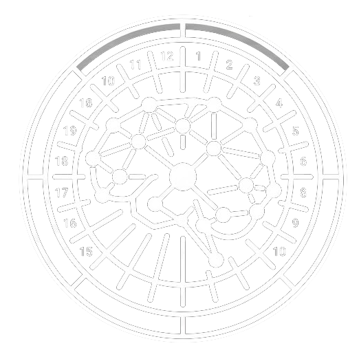
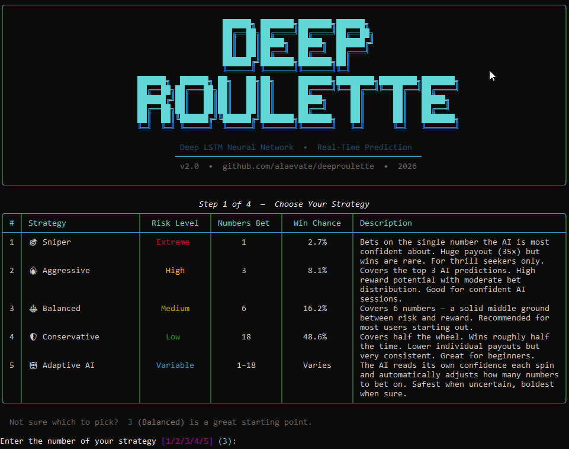

<h1 align="center">
  <a href="https://github.com/alaevate/deeproulette"></a>
  <br>
  DeepRoulette
</h1>

<h4 align="center">LSTM-powered roulette predictor<br>real-time learning, 5 betting strategies, works with any table.</h4>

<p align="center">
  <a href="https://github.com/alaevate/deeproulette/issues">
    
  </a>
  <a href="https://github.com/alaevate/deeproulette/pulls">
    
  </a>
  <a href="https://discord.gg/UPyggZ2cK8">
    
  </a>
  <a href="https://github.com/alaevate/deeproulette/graphs/contributors">
    
  </a>
</p>

<p align="center">
  <a href="#-quick-start--no-tech-knowledge-needed">🚀 Quick Start</a> •
  <a href="#-strategies">📊 Strategies</a> •
  <a href="#-project-structure">📁 Structure</a> •
  <a href="#-how-it-works">🧠 How It Works</a> •
  <a href="#%EF%B8%8F-advanced-settings">⚙️ Settings</a>
</p>

<p align="center">
  
</p>

## ⚠️ Disclaimer

> **This software is for educational and research purposes only.**
> Roulette is a game of pure chance. The house always has an edge.
> No AI system can guarantee wins. Never gamble with money you cannot afford to lose.
> Always gamble responsibly.

---

## 🚀 Quick Start — No Tech Knowledge Needed

### ⚡ Option 1 — Download the EXE (Windows only, easiest)

1. Go to **[Releases](https://github.com/alaevate/deeproulette/releases/latest)**
2. Under **Assets**, download **`DeepRoulette-v2.0.0-windows.exe`**
3. Run it — no Python, no setup, nothing to install

> ⚠️ The file is ~400–700 MB because it bundles the full AI (TensorFlow) inside.

---

### 🛠️ Option 2 — Run from Source

#### Step 1 — Install Python (one-time, skip if already installed)

1. Go to **https://www.python.org/downloads/**
2. Download the latest Python 3 installer
3. **Windows**: Run the installer and tick **"Add Python to PATH"**
4. **Linux**: `sudo apt install python3 python3-pip`
5. **macOS**: `brew install python` or download from python.org

#### Step 2 — Set up the project (one-time)

| OS | Command |
|---|---|
| 🪟 Windows | Double-click **`scripts/install.bat`** |
| 🐧 Linux | `bash scripts/install.sh` |
| 🍎 macOS | `bash scripts/install.sh` |

#### Step 3 — Run the program

| OS | Command |
|---|---|
| 🪟 Windows | Double-click **`scripts/run.bat`** |
| 🐧 Linux | `bash scripts/run.sh` |
| 🍎 macOS | `bash scripts/run.sh` |

That's it! An interactive menu will guide you through everything — no typing of commands needed.

---

## 📊 Strategies

Choose a strategy in the interactive menu. Each one tells the AI how many numbers to bet on per spin:

| Strategy | Numbers Bet | Win Chance | Risk | Best For |
|---|---|---|---|---|
| 🎯 **Sniper** | 1 | ~2.7% | Extreme | Thrill seekers — huge payouts, rare wins |
| 🔥 **Aggressive** | 3 | ~8.1% | High | Confident sessions with strong AI training |
| ⚖️ **Balanced** | 6 | ~16.2% | Medium | **Recommended starting point** |
| 🛡️ **Conservative** | 18 | ~48.6% | Low | Beginners — most consistent results |
| 🤖 **Adaptive AI** | 1–18 | Varies | Variable | Let the AI decide based on its own confidence |

> **Not sure which to pick?** Start with **Balanced** or **Conservative**.

---

## 🧠 How It Works

```
  Roulette Table  (live, online, or manual entry)
       │  (spin result every ~30 seconds)
       ▼
  Live Feed / Simulator
       │  (integer 0–36)
       ▼
  Prediction Engine
       │
       ├── [History buffer]  Collects the last 15 spin results
       │
       ├── [Neural Network]  3-layer LSTM → outputs a probability
       │                     for each of the 37 possible numbers
       │
       ├── [Strategy]        Picks the top N numbers by probability
       │
       ├── [Betting]         Sizes bets as 2% of balance per number
       │
       ├── [Accounting]      Win: +35× the winning bet − all bets
       │                     Loss: −all bets
       │
       ├── [Statistics]      Updates win rate, ROI, streak
       │
       └── [Auto-train]      (if enabled) Re-trains the model on
                             recent history — model improves over time
```

### The AI Model

- **Architecture**: 3 stacked LSTM layers (256 → 128 → 64 units), followed by 2 Dense layers
- **Input**: The last 15 spin results, normalised to [0, 1]
- **Output**: A probability distribution over all 37 numbers (0–36)
- **Training**: Categorical cross-entropy loss, Adam optimiser, early stopping
- **Online learning**: Optional — the model updates after every spin using the most recent 150 results

---

## ⚙️ Advanced Settings

All settings are in [`config/settings.py`](config/settings.py). Key values:

| Setting | Default | What it controls |
|---|---|---|
| `SEQUENCE_LENGTH` | `15` | Past spins used as AI input |
| `BET_FRACTION` | `0.02` | Fraction of balance bet per number |
| `AUTO_TRAIN_MIN` | `30` | Min spins before online training starts |
| `RECONNECT_DELAY` | `30` | Seconds before WebSocket reconnect |
| `TRAINING_EPOCHS` | `100` | Epochs for full offline training |
| `CHECKPOINT_MODE` | `False` | Pause at 100/250/500/1000 spins to show stats |

---

## 🤝 Contributing

Pull requests and issues are welcome!

---

## 📄 License

MIT License — see [LICENSE](LICENSE)

---

<picture>
  <source media="(prefers-color-scheme: dark)" srcset="https://api.star-history.com/image?repos=alaevate/deeproulette&type=Date&theme=dark" width="100%" height="auto" />
  <source media="(prefers-color-scheme: light)" srcset="https://api.star-history.com/image?repos=alaevate/deeproulette&type=Date" width="100%" height="auto" />
  
</picture>

<div align="center"><sub>Built with ❤️ by <a href="https://github.com/alaevate">Alaevate</a></sub></div>
